# :iphone: Mobile Automation Framework
[allure_report]: https://ovidiocbba.github.io/mobile-automation-framework/

[](https://github.com/ovidiocbba/mobile-automation-framework/actions/workflows/mobile-execution.yml)

[:bar_chart: View Allure Report][allure_report]

Automation framework for mobile testing using **Appium**, **Cucumber**, **TestNG**, and **Allure**.

---

# :rocket: Prerequisites

Ensure the following tools are installed:

---

## 1. Java

* Version: **17+**

```bash
java -version
```

```bash
$ java -version
java version "17.0.12" 2024-07-16 LTS
Java(TM) SE Runtime Environment (build 17.0.12+8-LTS-286)
Java HotSpot(TM) 64-Bit Server VM (build 17.0.12+8-LTS-286, mixed mode, sharing)
```

---

## 2. Node.js & npm

* Node.js: **v18+ (recommended v20+)**
* npm: **v9+**

```bash
node -v
npm -v
```

```bash
$ node -v
v24.14.0

$ npm -v
11.9.0
```

---

## 3. Appium 2

Install Appium globally:

```bash
npm install -g appium
```

Verify installation:

```bash
appium -v
```

```bash
$ appium -v
3.2.2
```

Install Android driver:

```bash
appium driver install uiautomator2
```

```bash
$ appium driver install uiautomator2
⠋ Checking if 'appium-uiautomator2-driver' is compatible(node:10004) [DEP0190] DeprecationWarning: Passing args to a child process with shell option true can lead to security vulnerabilities, as the arguments are not escaped, only concatenated.
(Use `node --trace-deprecation ...` to show where the warning was created)
✔ Checking if 'appium-uiautomator2-driver' is compatible
✔ Installing 'uiautomator2'
✔ Validating 'uiautomator2'
ℹ Driver uiautomator2@7.0.0 successfully installed
- automationName: UiAutomator2
- platformNames: ["Android"]
```

Verify drivers:

```bash
appium driver list
```

```bash
$ appium driver list
- uiautomator2@7.0.0 [installed]
```

---

## 4. Android SDK

Install **Android Studio** from the official website.

```
Android Studio Panda 2 | 2025.3.2 for Windows
```
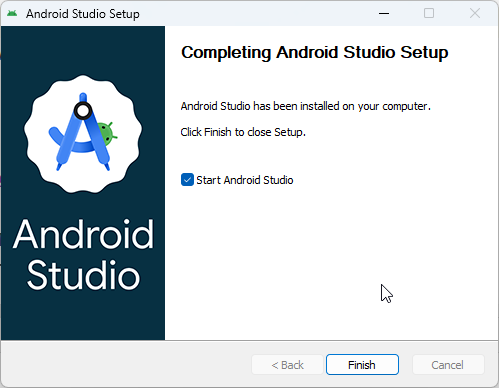
After installation, open Android Studio and configure SDK components.

---

### Step 1: Open SDK Manager

* From welcome screen: **More Actions → SDK Manager**

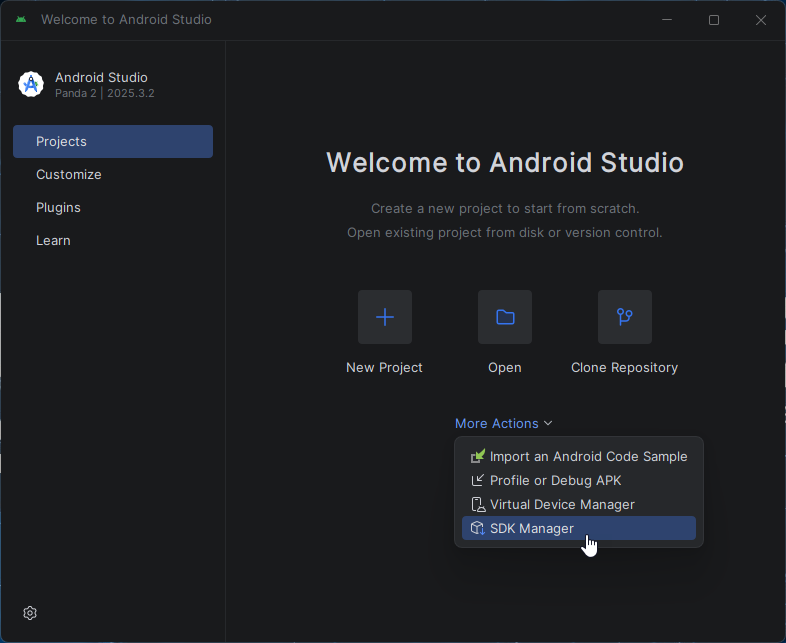

* Or inside project: **File → Settings → Android SDK**

---

### Step 2: Install SDK components

In **SDK Platforms** tab:

* Install:

    * Android 13 (API 33) or Android 14 (API 34)

In **SDK Tools** tab:

* Install:

    * Android SDK Platform-Tools (ADB)
    * Android Emulator
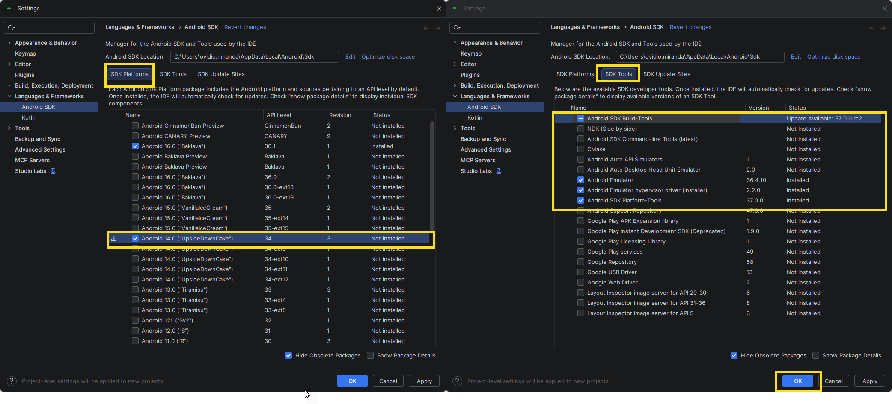

> :warning: This step will download required components.

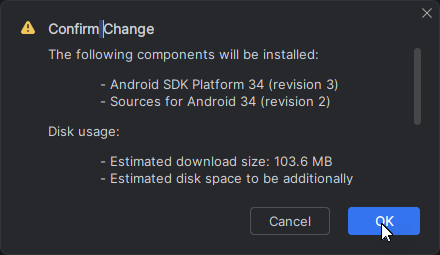

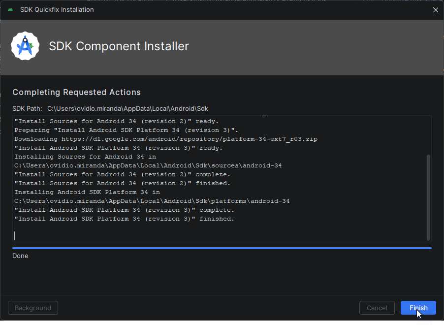

---

## :gear: Environment variables (Windows)

Follow these steps to configure Android SDK environment variables.

---

### Step 1: Open Environment Variables

1. Press:

Ctrl + R

2. Type:

SystemPropertiesAdvanced

3. Click OK

4. Click Environment Variables

---

### Step 2: Create ANDROID_HOME

1. In System variables, click New

2. Set:

**Name**: ANDROID_HOME
**Value**: C:\Users\<user>\AppData\Local\Android\Sdk

**Example:**
```
C:\Users\ovidio.miranda\AppData\Local\Android\Sdk
```

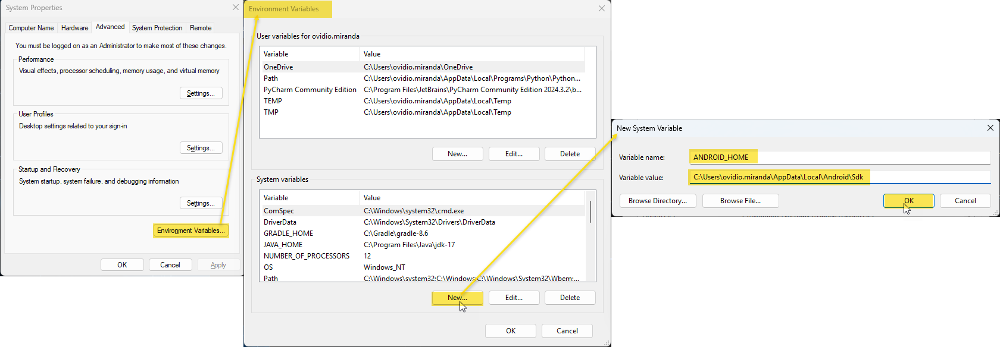

---

### Step 3: Update PATH

1. In **System variables**, select Path
2. Click **Edit**
3. Click **New** and add:
```
%ANDROID_HOME%\platform-tools
%ANDROID_HOME%\emulator
```

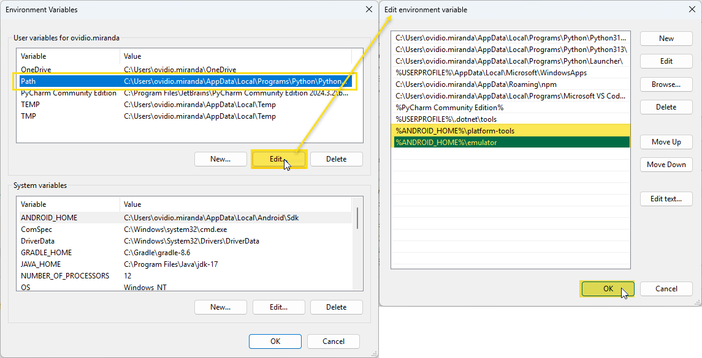

---

### Step 4: Apply changes

- Click **OK** in all windows
- Close your terminal
- Open a new terminal (Git Bash or CMD)

---

### Step 5: Verify installation

Run:
```
adb version
emulator -version
emulator -list-avds
```
---

### Expected output

adb version -> shows Android Debug Bridge version
emulator -version -> shows emulator version
emulator -list-avds -> shows available devices

```
ovidio.miranda@BOL-LT-241205B MINGW64 ~/Documents/Projects/mobile-automation-framework (main)
$ adb version
Android Debug Bridge version 1.0.41
Version 37.0.0-14910828
Installed as C:\Users\ovidio.miranda\AppData\Local\Android\Sdk\platform-tools\adb.exe
Running on Windows 10.0.26200

ovidio.miranda@BOL-LT-241205B MINGW64 ~/Documents/Projects/mobile-automation-framework (main)
$ emulator -version
INFO         | Android emulator version 36.4.10.0 (build_id 15004761) (CL:N/A)
INFO         | Graphics backend: gfxstream
Android emulator version 36.4.10.0 (build_id 15004761) (CL:N/A)
Copyright (C) 2006-2024 The Android Open Source Project and many others.
This program is a derivative of the QEMU CPU emulator (www.qemu.org).

  This software is licensed under the terms of the GNU General Public
  License version 2, as published by the Free Software Foundation, and
  may be copied, distributed, and modified under those terms.

  This program is distributed in the hope that it will be useful,
  but WITHOUT ANY WARRANTY; without even the implied warranty of
  MERCHANTABILITY or FITNESS FOR A PARTICULAR PURPOSE.  See the
  GNU General Public License for more details.

ovidio.miranda@BOL-LT-241205B MINGW64 ~/Documents/Projects/mobile-automation-framework (main)
$ emulator -list-avds
Medium_Phone_API_36.1

```
---

### :white_check_mark: Success criteria

- adb command works
- emulator command works
- At least one AVD is listed

---

### :white_check_mark: Verify ADB

```bash
adb devices
```

Expected:

```bash
List of devices attached
```

---

# :iphone: Emulator Setup

---

## Step 1: Open Virtual Device Manager

* Android Studio → **More Actions → Virtual Device Manager**

---

## Step 2: Create emulator

* Click **Create Device**

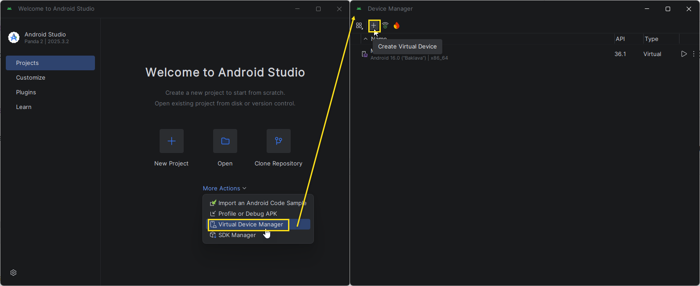

* Select:

    * Phone: **Pixel 7**

---

## Step 3: Download system image

* Select:

    * API Level: **33 or 34**
* Click **Finish** (~1–2GB)

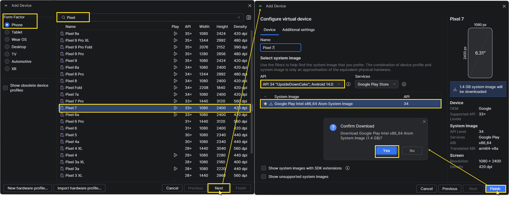

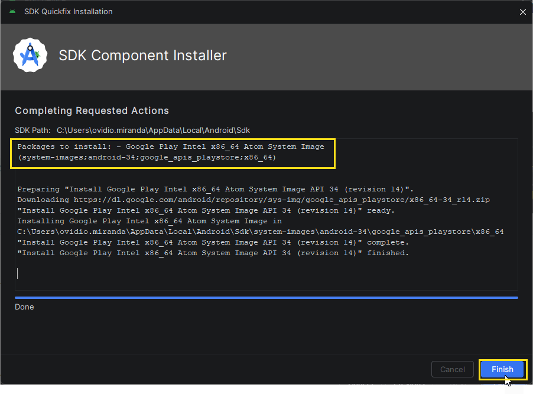

---

## Step 4: Start emulator

### Option 1: Start from Android Studio (UI)

1. Open **Virtual Device Manager**
2. Click the ▶ (Play) button on your device

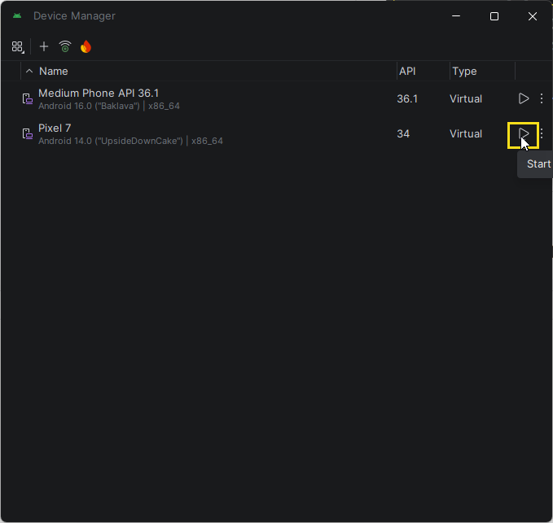

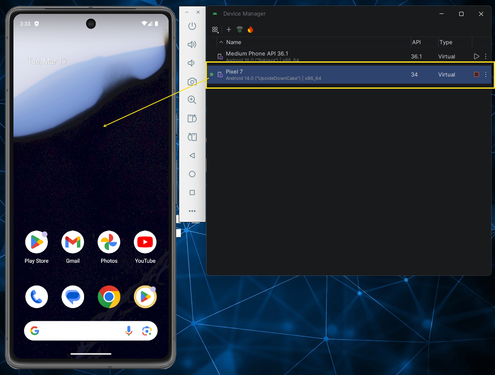

### Option 2: Start from Command Line

#### Step 1: List available emulators

```
emulator -list-avds
```

**Example output**

```
$ emulator -list-avds
Medium_Phone_API_36.1
Pixel_7
```

**Step 2: Start emulator**

```bash
emulator -avd <AVD_NAME>
```

**Example**

```bash
emulator -avd Pixel_7
```

---

## :white_check_mark: Verify emulator

```bash
adb devices
```

Expected:

```bash
$ adb devices
List of devices attached
emulator-5554   device

```

---

# :gear: Configuration

Edit:

```
config/config.properties
```

Example:

```properties
platform=ANDROID

deviceName=emulator-5554
platformVersion=14
automationName=UiAutomator2

# App location
app=apps/android/mda-2.2.0-25.apk

# Android specific
appPackage=com.saucelabs.mydemoapp.rn
appActivity=com.saucelabs.mydemoapp.rn.MainActivity

# iOS specific
bundleId=com.saucelabs.mydemoapp.rn

# Appium
appiumServerUrl=http://127.0.0.1:4723

explicitWait=20
threads=2
```

---

# :arrow_forward: Running Tests

---

## 1. Start Appium

```bash
appium
```

---

## 2. Run tests

```bash
./gradlew clean test
```

---

# :bar_chart: Reports (Allure)

Generate report:

```bash
allure serve build/allure-results
```

---

# :mag: Tools

### Appium Inspector

Tool used to inspect mobile elements and obtain locators.

👉 **Open documentation:**

[APPIUM_INSPECTOR.md](docs/APPIUM_INSPECTOR.md)

---

# :information_source: Notes

* Emulator must be running before tests
* System properties override `config.properties`
* First setup may download **3–5GB** (SDK + emulator)
* iOS requires macOS and Xcode

---
