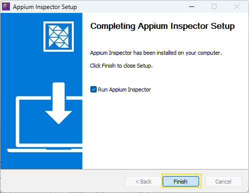
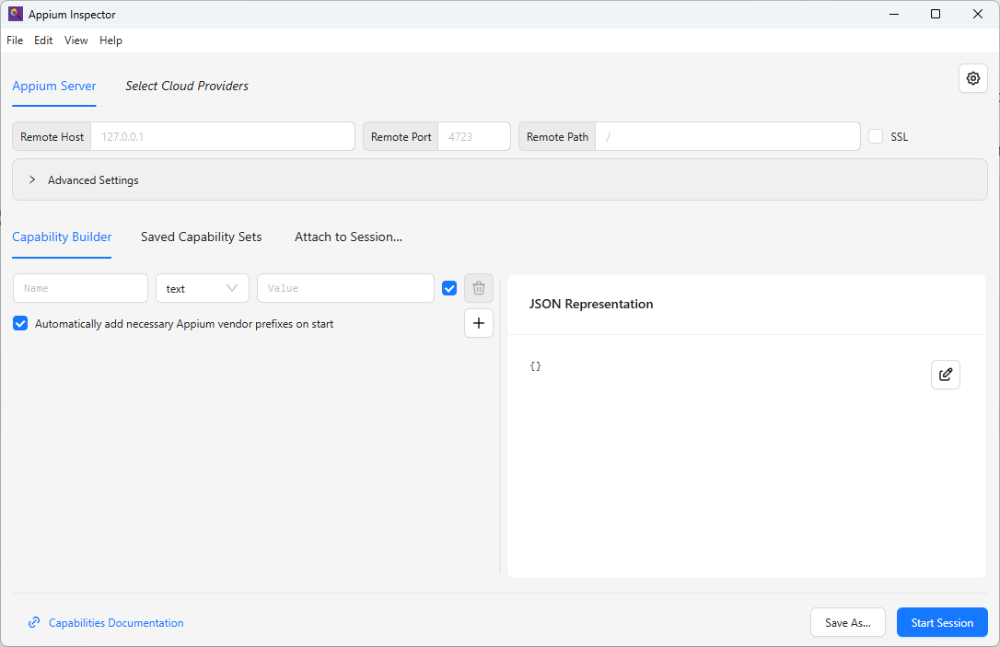
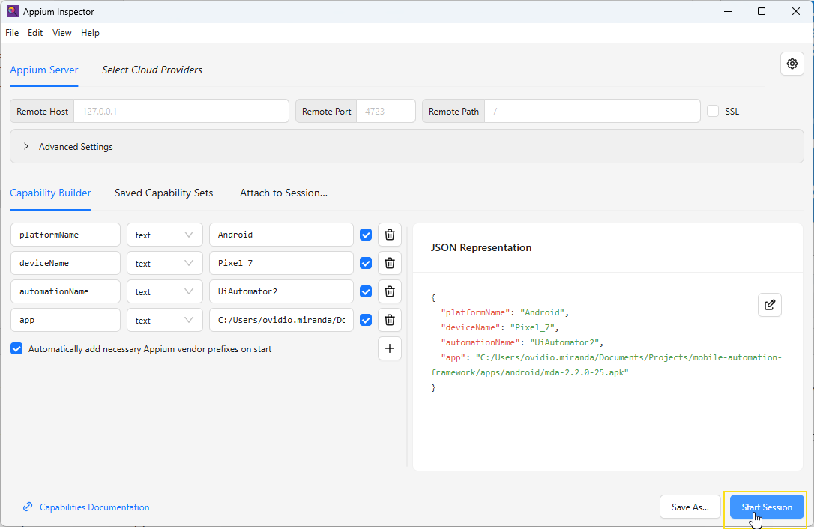
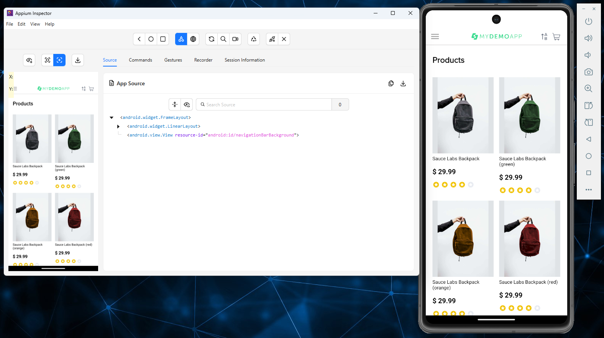

# :book: Appium Inspector

Tool used to inspect mobile elements and obtain locators for automation.

---

<h1>Table of contents</h1>

- [:arrow_down: 1. Download Appium Inspector](#arrow_down-1-download-appium-inspector)
- [:gear: 2. Installation](#gear-2-installation)
- [:electric_plug: 3. Start Emulator (Optional)](#electric_plug-3-start-emulator-optional)
- [:wrench: 4. Configure Session](#wrench-4-configure-session)
- [:rocket: 5. Start Session](#rocket-5-start-session)
- [:mag: 6. Inspect Elements](#mag-6-inspect-elements)
    - [:triangular_flag_on_post: 6.1 Locator Priority](#triangular_flag_on_post-61-locator-priority)
    - [:clipboard: 6.2 Rules](#clipboard-62-rules)
    - [:bar_chart: 6.3 Summary](#bar_chart-63-summary)

---

## :arrow_down: 1. Download Appium Inspector

Download the latest version from:

https://github.com/appium/appium-inspector/releases

**Windows**
```
Appium-Inspector-2026.2.1-win-x64.exe
```

**Mac - Apple Silicon (M1 / M2 / M3)**
```
Appium-Inspector-2026.2.1-mac-arm64.dmg
```

**Mac - Intel**
```
Appium-Inspector-2026.2.1-mac-x64.dmg
```

<div align="right">
  <strong>
    <a href="#table-of-contents" style="text-decoration: none;">↥ Back to top</a>
  </strong>
</div>

---

## :gear: 2. Installation

1. Open the downloaded file
2. Follow the installation wizard
3. Launch Appium Inspector





<div align="right">
  <strong>
    <a href="#table-of-contents" style="text-decoration: none;">↥ Back to top</a>
  </strong>
</div>

---

## :electric_plug: 3. Start Emulator (Optional)

### Step 1: List available emulators

```
emulator -list-avds
```

**Example output**
```
Pixel_7_API_34
Pixel_8_API_35
```

### Step 2: Start emulator

```bash
emulator -avd <AVD_NAME>
```

**Example**
```bash
emulator -avd Pixel7_API34
```

<div align="right">
  <strong>
    <a href="#table-of-contents" style="text-decoration: none;">↥ Back to top</a>
  </strong>
</div>

---

## :wrench: 4. Configure Session

Use the following capabilities:

```json
{
  "platformName": "Android",
  "appium:deviceName": "Pixel_7_API_34",
  "appium:automationName": "UiAutomator2",
  "appium:app": "C:/Users/ovidio.miranda/Documents/Projects/mobile-automation-framework/apps/android/Android.SauceLabs.Mobile.Sample.app.2.7.1.apk",
  "appium:autoGrantPermissions": true,
  "appium:appPackage": "com.swaglabsmobileapp",
  "appium:appActivity": "com.swaglabsmobileapp.MainActivity",
  "appium:appWaitActivity": "*"
}
```

<div align="right">
  <strong>
    <a href="#table-of-contents" style="text-decoration: none;">↥ Back to top</a>
  </strong>
</div>

---

## :rocket: 5. Start Session

Ensure the emulator and Appium server are running:

```bash
appium
```

Then click **Start Session**.





<div align="right">
  <strong>
    <a href="#table-of-contents" style="text-decoration: none;">↥ Back to top</a>
  </strong>
</div>

---

## :mag: 6. Inspect Elements

Use locators following best practices from large-scale mobile automation projects.

---

### :triangular_flag_on_post: 6.1 Locator Priority

#### 1. **resource-id (PRIMARY – default choice)**

- Most stable and fastest locator in Android
- Does not depend on UI text or language
- Preferred for long-term maintainability

```java
com.saucelabs.mydemoapp.android:id/menuIV
AppiumBy.id("menuIV")
```

<div align="right">
  <strong>
    <a href="#table-of-contents" style="text-decoration: none;">↥ Back to top</a>
  </strong>
</div>

---

#### 2. **accessibilityId (SECONDARY)**

- Based on `content-desc`
- Used when resource-id is not unique or not available
- Good for semantic and readable locators

```java
AppiumBy.accessibilityId("Login Menu Item")
```

<div align="right">
  <strong>
    <a href="#table-of-contents" style="text-decoration: none;">↥ Back to top</a>
  </strong>
</div>

---

#### 3. **xpath (FALLBACK ONLY)**

- Use only when no stable locator exists
- Slower and more fragile
- Can combine attributes when necessary

```java
AppiumBy.xpath("//*[@resource-id='com.saucelabs.mydemoapp.android:id/itemTV' and @text='Log In']")
```

<div align="right">
  <strong>
    <a href="#table-of-contents" style="text-decoration: none;">↥ Back to top</a>
  </strong>
</div>

---

### :clipboard: 6.2 Rules

- Always try **resource-id** first
- Use **accessibilityId** only if it adds uniqueness or clarity
- Use **xpath** as last resort

**Never use:**
- index
- elementId
- only class

<div align="right">
  <strong>
    <a href="#table-of-contents" style="text-decoration: none;">↥ Back to top</a>
  </strong>
</div>

---

### :bar_chart: 6.3 Summary

| Priority | Locator Type    | When to use                          |
|----------|----------------|--------------------------------------|
| 1        | resource-id     | Default for Android elements         |
| 2        | accessibilityId | When ID is not unique or unavailable |
| 3        | xpath           | Only if no other option exists       |

<div align="right">
  <strong>
    <a href="#table-of-contents" style="text-decoration: none;">↥ Back to top</a>
  </strong>
</div>

---
