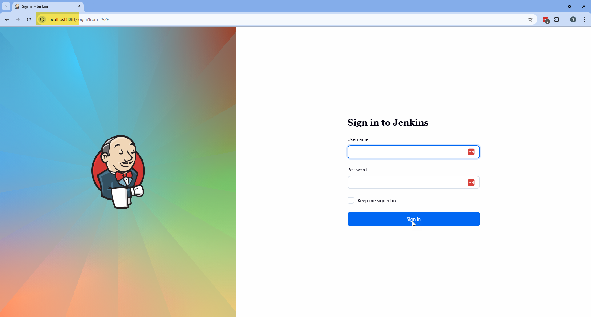
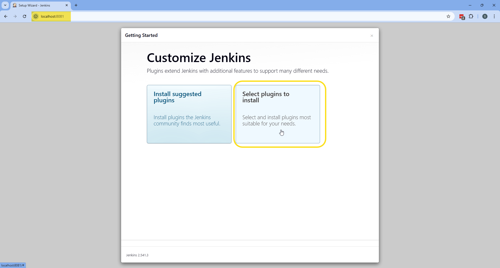
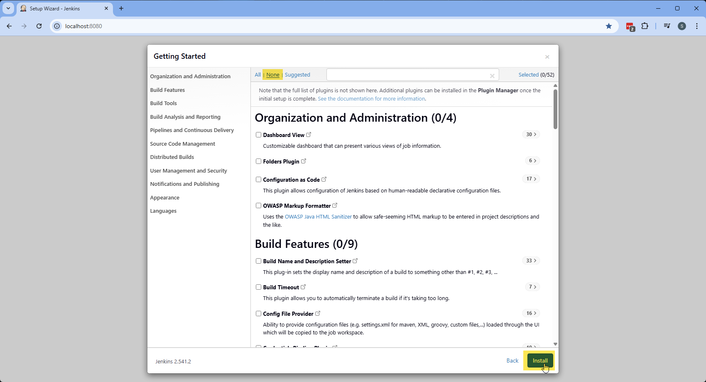
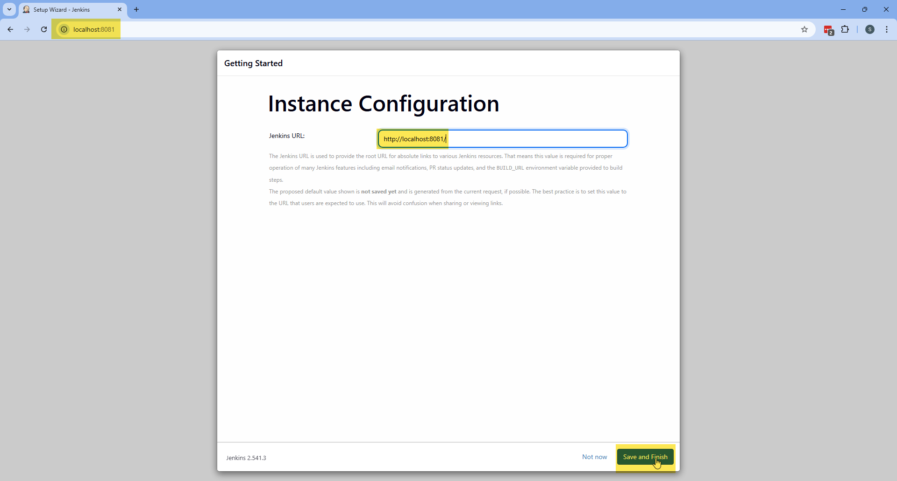
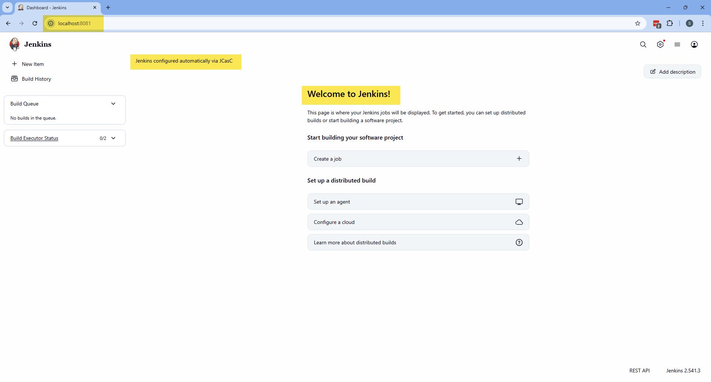
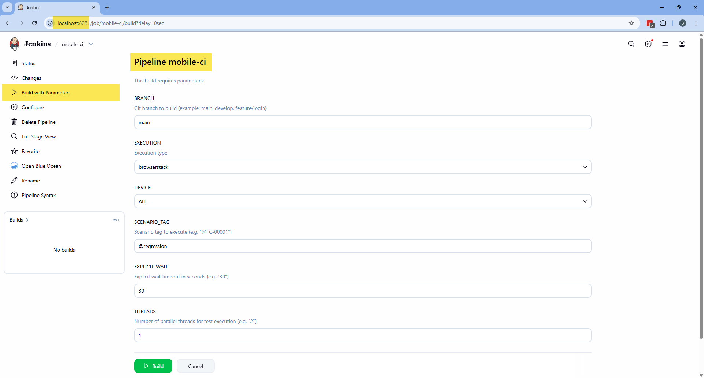

# 🚀 Jenkins Setup with Docker

This guide explains how to build and run a fully configured **Jenkins Mobile Automation Server** using Docker with persistent storage and browser support.

---

<h1>Table of contents</h1>

* [:whale: 1. Build Docker Image](#whale-1-build-docker-image)
* [:floppy_disk: 2. Create Persistent Volume](#floppy_disk-2-create-persistent-volume)
* [:rocket: 3. Run Jenkins Container](#rocket-3-run-jenkins-container)
* [:gear: 4. Initial Jenkins Setup](#gear-4-initial-jenkins-setup)
* [:iphone: 5. Local Android Emulators](#iphone-5-local-android-emulators)
* [:key: 6. Accessing the Jenkins Container](#key-6-accessing-the-jenkins-container)
* [:wastebasket: 7. Clean Setup (Optional)](#wastebasket-7-clean-setup-optional)
* [:memo: 8. Notes](#memo-8-notes)
---

## :whale: 1. Build Docker Image

The `Dockerfile` is located at:

> mobile-automation-framework/Dockerfile


If you are inside the `mobile-automation-framework` folder, you can run

```bash
docker build --no-cache -t jenkins-mobile-ci:1.0.0 .
```

Builds a custom Jenkins image with the required plugins.

### 🔧 This image includes:

* Java 17
* Allure CLI
* Node.js (optional tools)
* Jenkins plugins (Pipeline, Allure, HTML Publisher, Blue Ocean, etc.)
* UTF-8 configuration (important for logs and reports)

<div align="right">
  <strong>
    <a href="#table-of-contents">↥ Back to top</a>
  </strong>
</div>

---

## :floppy_disk: 2. Create Persistent Volume

```bash
docker volume create jenkins_mobile_ci
```

This volume stores:

* Jenkins configuration
* Jobs
* Plugins
* Allure history
* Credentials

⚠ Data persists even if the container is removed.

<div align="right">
  <strong>
    <a href="#table-of-contents">↥ Back to top</a>
  </strong>
</div>

---

## :rocket: 3. Run Jenkins Container

### Run Jenkins using the `.env` file:

Jenkins **must** be started using the `.env` file.

**Environment file location**

All required variables are defined in:

> jenkins/env/.env.qa

You only maintain this file.
The Docker command never needs to change.

---

```bash
docker run -d \
  --name jenkins-mobile-automation \
  --restart unless-stopped \
  -p 8081:8080 \
  -p 50001:50000 \
  -v jenkins_mobile_ci:/var/jenkins_home \
  --env-file jenkins/env/.env.qa \
  --add-host=host.docker.internal:host-gateway \
  jenkins-mobile-ci:1.0.0
```

### 🔎 What each option does:

| Option                                   | Description                                      |
|------------------------------------------|--------------------------------------------------|
| `--restart unless-stopped`               | Automatically restarts the container if it stops |
| `-p 8081:8080`                           | Exposes Jenkins web interface (UI)               |
| `-p 50001:50000`                         | Agent communication port for Jenkins nodes       |
| `-v jenkins_mobile_ci:/var/jenkins_home` | Persists Jenkins data between container restarts |
| `--env-file .env`                        | Load variables from file                         |

<div align="right">
  <strong>
    <a href="#table-of-contents">↥ Back to top</a>
  </strong>
</div>

## :gear: 4. Initial Jenkins Setup

### 4.1 Plugin Installation

Open the default URL:

```
http://localhost:8081/
```

When you first access Jenkins, you will be prompted to log in.
Use the credentials specified in the environment variables (`JENKINS_ADMIN_ID` and `JENKINS_ADMIN_PASSWORD`) to access Jenkins.



Since plugins are already installed via Dockerfile:

Select:

```
Select plugins to install
```



Then choose:

```
None
```

Click **Install**.



No need to install suggested plugins again.

---

### 4.2 Instance Configuration

Click:

```
Save and Finish
```



Then click:

```
Start using Jenkins
```


---

✅ Jenkins is now ready to use.



> ⚠️ **Important (JCasC Setup):**
> Since this project uses Jenkins Configuration as Code, a **manual restart is required on the first run** to properly load the pipeline configuration.
>
> After Jenkins starts for the first time, restart the container:

```bash
docker restart jenkins-mobile-automation
```

Once restarted, all pipelines and configurations will be correctly loaded.




<div align="right">
  <strong>
    <a href="#table-of-contents">↥ Back to top</a>
  </strong>
</div>

---

# :iphone: 5. Local Android Emulators

This framework also supports **running tests on local Android emulators
using Appium**.

This is useful for:

-   Local development
-   Debugging tests faster
-   Running tests without BrowserStack
-   Parallel execution using multiple emulators

------------------------------------------------------------------------
## 5.0 Install Android System Images

If you have **low RAM**, use images **without Play Store (google_apis)**:

```bash
sdkmanager.bat "system-images;android-35;google_apis;x86_64"
```

```bash
sdkmanager.bat "system-images;android-34;google_apis;x86_64"
```

These images:
- Use less RAM
- Start faster
- Are better for CI and local testing

If you have **high RAM**, you can use images **with Play Store**:

Change:
```
google_apis → google_apis_playstore
```

Example:
```bash
sdkmanager.bat "system-images;android-35;google_apis_playstore;x86_64"
```

<div align="right">
  <strong>
    <a href="#table-of-contents">↥ Back to top</a>
  </strong>
</div>

---

## 5.1 Create Android Emulators

Create the emulators:

```bash
avdmanager.bat create avd \
  -n Pixel_7_API_34 \
  -k "system-images;android-34;google_apis;x86_64" \
  --device "pixel_7"
```

```bash
avdmanager.bat create avd \
  -n Pixel_8_API_35 \
  -k "system-images;android-35;google_apis;x86_64" \
  --device "pixel_8"
```

<div align="right">
  <strong>
    <a href="#table-of-contents">↥ Back to top</a>
  </strong>
</div>

---

## 5.2 Start Android Emulators

Run the emulators:

``` bash
emulator -avd Pixel_7_API_34 \
  -port 5554 \
  -no-audio \
  -no-boot-anim \
  -gpu host \
  -accel on
```

``` bash
emulator -avd Pixel_8_API_35 \
  -port 5556 \
  -no-audio \
  -no-boot-anim \
  -gpu host \
  -accel on
```

Verify:

``` bash
adb devices
```

Example output:

``` bash
List of devices attached
emulator-5554   device
emulator-5556   device
```

<div align="right">
  <strong>
    <a href="#table-of-contents">↥ Back to top</a>
  </strong>
</div>

---

## 5.3 Start Appium Server

> ⚠️ **Important**
>
> Run Appium **from the project root folder**.
> If not, it may not find APK/iOS files and tests can fail.

### 1. Go to project folder

```bash
cd C:\\Users\\ovidio.miranda\\Documents\\Projects\\mobile-automation-framework
```

### 2. Start Appium

``` bash
appium
```

### 3. Default URL (local execution)

```
http://localhost:4723
```

### 4. Docker usage

Inside Docker, the container accesses Appium using:

```
http://host.docker.internal:4723
```

<div align="right">
  <strong>
    <a href="#table-of-contents">↥ Back to top</a>
  </strong>
</div>

---

## 5.4 Local Emulator Configuration

Example configuration for devices:

``` json
[
  {
    "type": "local",
    "platform": "ANDROID",
    "deviceName": "Pixel 7 API 34",
    "platformVersion": "14",
    "automationName": "UiAutomator2",
    "udid": "emulator-5554",
    "appiumServerUrl": "http://host.docker.internal:4723"
  },
  {
    "type": "local",
    "platform": "ANDROID",
    "deviceName": "Pixel 8 API 35",
    "platformVersion": "15",
    "automationName": "UiAutomator2",
    "udid": "emulator-5556",
    "appiumServerUrl": "http://host.docker.internal:4723"
  }
]
```

<div align="right">
  <strong>
    <a href="#table-of-contents">↥ Back to top</a>
  </strong>
</div>

---

## 5.5 If You Changed `localDevices.json`

If Jenkins is already running and you updated the device configuration
file (`localDevices.json`), you need to copy the new file into the
container.

1. Copy the updated file to the Jenkins container

``` bash
docker cp jenkins/resources/devices/localDevices.json jenkins-mobile-automation:/var/jenkins_home/resources/devices/localDevices.json
```

2. Restart the Jenkins container

``` bash
docker restart jenkins-mobile-automation
```

3. Verify the file inside the container

``` bash
docker exec -it jenkins-mobile-automation bash
```

Then run:

``` bash
cat /var/jenkins_home/resources/devices/localDevices.json
```
You should see the updated device configuration.

<div align="right">
  <strong>
    <a href="#table-of-contents">↥ Back to top</a>
  </strong>
</div>

---

## 5.6 Parallel Execution

When two emulators are running:

```
emulator-5554
emulator-5556
```

The framework can distribute tests between both devices.

<div align="right">
  <strong>
    <a href="#table-of-contents">↥ Back to top</a>
  </strong>
</div>

---

## 5.7 Delete Android Emulators

To remove an existing Android emulator (AVD), follow these steps:

### 1. List available emulators

```bash
avdmanager.bat list avd
```

Example output:

```bash
Available Android Virtual Devices:
    Name: Pixel_7_API_34
    Name: Pixel_8_API_35
```

---

### 2. Delete a specific emulator

```bash
avdmanager.bat delete avd -n Pixel_7_API_34
```

```bash
avdmanager.bat delete avd -n Pixel_8_API_35
```

---

### 3. Verify deletion

```bash
avdmanager.bat list avd
```

The deleted emulator should no longer appear in the list.

---

### ⚠️ Notes

- Make sure the emulator is **not running** before deleting it.
- If needed, stop it using:

```bash
adb -s emulator-5554 emu kill
```

- Deleting an AVD **does not remove system images**, only the emulator instance.
---

### :key: 6. Accessing the Jenkins Container

To access the Jenkins container's shell for troubleshooting or configuration, run this command:

```
docker exec -it jenkins-mobile-automation bash
```

This will open an interactive shell inside the running container. From here, you can:

- Check logs
- Change Jenkins settings
- Troubleshoot problems

To exit the shell, type:
```
exit
```

<div align="right">
  <strong>
    <a href="#table-of-contents">↥ Back to top</a>
  </strong>
</div>

---

## :wastebasket: 7. Clean Setup (Optional)

Remove container:

```bash
docker rm -f jenkins-mobile-automation
```

Remove volume:

```bash
docker volume rm jenkins_mobile_ci
```

⚠ This will permanently delete all Jenkins data.

<div align="right">
  <strong>
    <a href="#table-of-contents">↥ Back to top</a>
  </strong>
</div>

---

## :memo: 8. Notes

* This setup is optimized for Mobile Automation using BrowserStack
* UTF-8 is enabled to avoid encoding issues
* Devices are configurable via environment variables
* Supports:
    - Parallel execution
    - Allure reports
    - Dynamic device selection

<div align="right">
  <strong>
    <a href="#table-of-contents">↥ Back to top</a>
  </strong>
</div>

---
